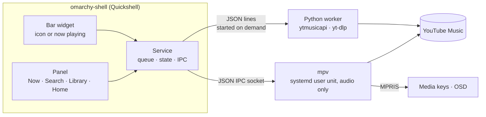

```text
                 ▄▄▄
 ▄█████▄    ▄███████████▄    ▄███████   ▄███████   ▄███████   ▄█   █▄    ▄█   █▄
███   ███  ███   ███   ███  ███   ███  ███   ███  ███   ███  ███   ███  ███   ███
███   ███  ███   ███   ███  ███   ███  ███   ███  ███   █▀   ███   ███  ███   ███
███   ███  ███   ███   ███ ▄███▄▄▄███ ▄███▄▄▄██▀  ███       ▄███▄▄▄███▄ ███▄▄▄███
███   ███  ███   ███   ███ ▀███▀▀▀███ ▀███▀▀▀▀    ███      ▀▀███▀▀▀███  ▀▀▀▀▀▀███
███   ███  ███   ███   ███  ███   ███ ██████████  ███   █▄   ███   ███  ▄██   ███
███   ███  ███   ███   ███  ███   ███  ███   ███  ███   ███  ███   ███  ███   ███
 ▀█████▀    ▀█   ███   █▀   ███   █▀   ███   ███  ███████▀   ███   █▀    ▀█████▀
                                       ███   █▀

           ━━━━━━━━  YouTube Music · a native Omarchy plugin  ━━━━━━━━
```

<div align="center">

# YouTube Music for Omarchy

[](https://github.com/Damir-VistaBlox/omarchy-ytmusic/releases)
[](LICENSE)
[](https://github.com/basecamp/omarchy)


Plugin id `damir.ytmusic` · the Omarchy logo is from [basecamp/omarchy](https://github.com/basecamp/omarchy) (MIT)

</div>

YouTube Music for the Omarchy bar without a browser: a native panel inside
`omarchy-shell`, [ytmusicapi](https://github.com/sigma67/ytmusicapi) for search
and your library, and mpv (with yt-dlp) for audio-only streaming. Nothing is
downloaded to disk.

Version 1.0.0. Not affiliated with YouTube or Google: it uses the unofficial
ytmusicapi and yt-dlp, which can break when YouTube changes something
(`omarchy update` usually brings the yt-dlp fix).

## At a glance

- 🔎 **Search** as you type, with suggestions and your recent searches
- 🎶 **Queue** with shuffle, repeat and autoplay (similar songs when it runs out)
- 📚 **Your library**: playlists (create, add, remove, delete), likes and Liked Music, History, Home
- 👤 **Artist and album pages**, one click from what's playing
- ⏯️ **Media keys and OSD** over MPRIS; the bar shows an icon or scrolling now-playing text
- ⚡ **Fast starts**: streams are looked up ahead, pages and covers come from a disk cache
- 🪶 **Light**: no browser; ~75 MiB while playing, nothing when idle; resumes where you stopped

```text
╭─ Now ─── Search ─── Library ─── Home ──────────────────────
│
│   ██████████    Around the World
│   ██ ♪  ♫ ██    Daft Punk
│   ██████████    Homework
│
│   ━━━━━━━━━━━━━━━━━━━━━━●──────────────────────   2:31 / 7:09
│
│      ♥      ↔      |◄     ■■     ►|      ⟲       +
│
│   QUEUE  1 / 11                      Autoplay     Clear
│   ► Around the World · Daft Punk                     7:09
│     Da Funk · Daft Punk                              5:28
│     One More Time · Daft Punk                        5:20
╰─                                    (a sketch of the Now tab)
```

```text
Memory while playing (PSS, measured on a 16 GB Omarchy laptop)

Chromium-based plugin   ████████████████████████████████████████   ~700 MiB
this plugin, playing    ████                                        ~75 MiB
this plugin, idle                                                     0 MiB
```

## Install

```bash
omarchy-pkg-add uv deno    # mpv, mpv-mpris and yt-dlp already come with Omarchy
omarchy plugin add https://github.com/Damir-VistaBlox/omarchy-ytmusic.git --enable
```

`uv` runs the ytmusicapi helper (it builds its own Python environment on
first use) and `deno` is yt-dlp's solver for YouTube's JavaScript challenge;
if either is missing, the panel shows a banner with an **Install** button.
`omarchy plugin update` pulls new versions.

Optional:

- **Sign in** for your playlists, likes, history and Home: Library → **Sign
  in** (or `~/.config/omarchy/plugins/damir.ytmusic/bin/ytm auth`). It copies
  your YouTube session from Chromium, so be signed in to YouTube there.
- **Shortcut**, e.g. in `~/.config/hypr/bindings.lua`:
  `o.bind("SUPER + M", "YouTube Music", "omarchy-shell shell toggle damir.ytmusic")`.
- **Check the installation**: `~/.config/omarchy/plugins/damir.ytmusic/bin/ytm selftest --online`.

Uninstall: `bin/ytm logout`, then `omarchy plugin remove damir.ytmusic` and
`rm -rf ~/.cache/omarchy-ytmusic`.

For development, clone into `~/.config/omarchy/plugins/damir.ytmusic` (a
real directory — the shell's file watcher and `omarchy plugin validate` don't
follow symlinks) and run `scripts/test.sh`.

## Using it

| Where | Action |
|---|---|
| Bar icon | Left click: open/close the panel · Middle click: play/pause · Right click: switch icon ⇄ now-playing text · Wheel: previous/next track |
| `SUPER + M` | Open/close the panel (`omarchy-shell shell toggle damir.ytmusic`, bound in `~/.config/hypr/bindings.lua`) |
| Panel tabs | **Now** (playing + queue, like, add to playlist, Resume; an artist, the album or the cover opens its page), **Search** (field, filters, grouped results), **Library** (account, Liked Music, History, your and saved playlists, new playlist) and **Home** (your shelves); albums, playlists and artists open as pages with Play / Shuffle / Queue all; your own playlists can remove songs and be deleted |
| Resume | After mpv has quit (idle timeout, logout, reboot) play/pause — middle click, media keys, `omarchy-shell ytmusic resume` or the Resume button — restores the queue, the track and its position. The snapshot is `~/.cache/omarchy-ytmusic/session.json`, saved after queue changes, on pause and every 30 s while playing. |
| Search | Results appear as you type. An empty field lists your recent searches (`x` forgets one); while typing, matching recent searches and YouTube Music's suggestions show above the results — click one, or `Tab` / `Shift+Tab` to put it in the field. A search is remembered only when it led somewhere (Enter, or a result was played, opened or queued), in `~/.cache/omarchy-ytmusic/searches.json`. |
| Shuffle / repeat | Buttons around the transport (or `s` / `r`). Shuffle mixes the songs after the current one and turning it off puts them back in their order (songs added meanwhile keep their places); with shuffle on, a clicked song plays first and the rest of its album or playlist follows shuffled, and a page's **Shuffle** button turns it on. Repeat cycles off → queue → this song (mpv's `loop-playlist` / `loop-file`, so MPRIS sees it too). Both are remembered in `~/.cache/omarchy-ytmusic/player.json`. |
| Autoplay | On by default (**Autoplay** in the queue header, IPC `autoplay`): five seconds into the last song of the queue, up to 10 songs from YouTube Music's up-next list for it are appended — songs before videos, nothing that is already in the queue. Off while repeat is on. |
| Panel keys | `1`–`4` switch tabs · `/` search · `j`/`k` or `↑`/`↓` move · `Enter` play or open · `n` play next · `a` add to queue · `L` like · `p` add to playlist · `A` / `o` open the artist / album (of the selected or current song) · `J`/`K` move a queued track · `x` remove (queue, own playlist, Liked Music, recent search) · `s` shuffle · `r` repeat · `Space` play/pause · `←`/`→` seek 10 s · `Esc` leave the field → close the picker → back → close. Shortcuts are off while typing. |
| IPC | `search "query"` (opens the panel on the results) · `shuffle` / `repeat` / `autoplay` (toggle or cycle, print the new state) · `like` / `unlike` / `toggleLike` (current track) · `signIn` / `signOut` / `reloadAuth` |

### Signing in

`bin/ytm auth` (or **Sign in** in the Library tab) copies the YouTube session
from your Chromium profile (`~/.config/chromium/Default`; another one with
`--from-browser chromium:PROFILE`) straight from the cookie store, never through the
clipboard (Omarchy's clipboard history is saved in plain text). The new
session is verified before it replaces the old one. The shell only reads
`account.json`; if YouTube stops accepting the session you get one
notification (click it to sign in again) and a banner in the panel, while
search and playback keep working. `bin/ytm auth --paste` accepts request
headers instead.

Bar display is a per-widget setting: `omarchy bar set damir.ytmusic display player`
(or `icon`). The panel is created on first open and unloaded 45 s after it
closes, so it holds no memory while you're not looking at it.

## How it works



mpv runs in its own systemd user unit, so music keeps playing through shell
restarts, and quits after 5 minutes idle (30 paused). The worker starts when
the panel needs it and exits after 3 idle minutes. The panel is unloaded 45 s
after it closes.

## Layout

| Path | Purpose |
|---|---|
| `manifest.json` | Omarchy plugin manifest (service + bar widget) |
| `Service.qml` | State, mpv and worker connections, `ytmusic` IPC target |
| `MpvClient.qml` | mpv JSON IPC client: request ids, observers, reconnects, starts the player |
| `Backend.qml` | ytmusicapi worker process: lazy start, request/callback, retry once |
| `YtmModel.js` | Pure helpers (queue commands, queue model, formatting); shared with Node tests |
| `BarWidget.qml` | Bar icon / now-playing, one per monitor; loads and unloads the panel |
| `Panel.qml` | The dropdown (Omarchy `KeyboardPanel`): now playing + queue, keyboard control |
| `Store.qml` | Last search and recently opened collections (5, 5 min), shared by all panels and kept across panel unloads |
| `components/` | `NowPlayingView`, `QueueView`, `SearchView`, `LibraryView`, `HomeView`, `CollectionView`, `PlaylistPicker`, `SignInCard`, `ResultList`, `TrackRow`, `CollectionRow`, `CoverArt` |
| `bin/ytm-mpv` | Starts/stops the detached mpv player (systemd user unit) |
| `mpv/ytm-idle.lua` | Quits mpv after it has idled or been paused too long |
| `backend/ytm.py` | ytmusicapi worker (`serve`) and CLI; PEP 723 script run with `uv` |
| `backend/ytm_normalize.py` | Turns ytmusicapi responses into stable Track/Album/Playlist/Artist/Collection shapes |
| `backend/ytm_auth.py` | Session files and sign-in (Chromium cookie import, pasted headers) |
| `bin/ytm` | CLI wrapper (`uv run --script backend/ytm.py`, no bytecode) |
| `scripts/test.sh` | Fixture secrets check + node + pytest, without caches |
| `scripts/mem.sh` | PSS report: shell, mpv unit, worker |
| `tests/` | Backend tests and anonymous recorded fixtures |

Private files live outside this repository:

| Path | Contents |
|---|---|
| `~/.config/omarchy-ytmusic/` (0700) | `browser.json`, `cookies.txt` (0600), `account.json` |
| `$XDG_RUNTIME_DIR/omarchy-ytmusic/` (0700) | mpv IPC socket |
| `~/.cache/omarchy-ytmusic/` (0700) | resume snapshot (`session.json`), player modes (`player.json`), recent searches (`searches.json`), response and cover caches |

## Commands

```bash
omarchy-shell ytmusic ping
omarchy-shell ytmusic status                    # JSON: mpv, worker, auth, now playing, queue
omarchy-shell ytmusic play "boards of canada"   # search songs, play the best match
omarchy-shell ytmusic queue "nils frahm says"   # search songs, add the best match
omarchy-shell ytmusic playPause|next|previous|stop
omarchy-shell ytmusic seek 90
omarchy-shell ytmusic volume 60
bin/ytm-mpv start|stop|status
scripts/mem.sh

bin/ytm auth                      # sign in: import the session from a Chromium profile
bin/ytm auth --paste              # fallback: paste request headers of a /browse call
bin/ytm whoami | logout
bin/ytm search daft punk --filter songs
bin/ytm call libraryPlaylists '{"limit": 5}'
bin/ytm selftest --online
scripts/test.sh
```

## Troubleshooting

| Symptom | What to do |
|---|---|
| "YouTube Music playback keeps failing" | yt-dlp is probably out of date for a YouTube change: `omarchy update`, then press play (it continues from the song that failed). `mpv --no-video 'https://www.youtube.com/watch?v=…'` shows yt-dlp's own error. |
| "Can't reach YouTube Music" | No connection. Press play once it's back; the queue is kept. |
| Sign-in expired (banner, notification) | Make sure you're signed in to YouTube in Chromium, then **Sign in again** (or `bin/ytm auth`). `bin/ytm auth --from-browser chromium:"Profile 1"` picks another profile. |
| Library, playlist or Home looks stale | It refreshes itself right after showing the cached copy. `rm -rf ~/.cache/omarchy-ytmusic/data` is always safe. |
| No bar icon | `omarchy plugin list \| grep ytmusic`, `omarchy plugin validate ~/.config/omarchy/plugins/damir.ytmusic`. |
| Something odd | `omarchy-shell ytmusic status \| jq` (player, worker, auth, last error), `bin/ytm selftest --online`, `journalctl --user -b \| grep ytmusic`. mpv itself runs with `--no-terminal`, so it logs almost nothing. |
| A QML change doesn't show | `omarchy restart shell` (hot reload keeps the old compiled QML). |
| Start over | `bin/ytm logout` and `rm -rf ~/.cache/omarchy-ytmusic`. |

## Security

Checked in Phase 7 (2026-09-11):

- The session lives in `~/.config/omarchy-ytmusic/` (0700; `browser.json`,
  `cookies.txt`, `account.json` 0600). The shell only reads `account.json`
  (name, handle, photo); the worker reads the session, and mpv's yt-dlp only
  when `YTM_STREAM_WITH_ACCOUNT=1`, and then by file path.
- No session data in the git history (scanned for cookie values and account
  e-mails), the journal, `omarchy-shell ytmusic status` or process command
  lines. Recorded fixtures are scrubbed, and `scripts/test.sh` fails on
  cookie-looking data in them.
- `~/.cache/omarchy-ytmusic/` is 0700, `data/` and `thumbs/` files 0600. The
  shell writes `session.json`, `player.json` and `searches.json` with the
  default umask (0644); the 0700 directory keeps them private.
- Covers are only downloaded over HTTPS from YouTube/Google image hosts.
- External text never reaches a shell: notifications and processes get
  argument arrays, mpv titles use byte-length quoting, and the only `sh -c`
  (mkdir for the cache) takes the path as `$1`.
- The `ytmusic` IPC target, like all Omarchy shell IPC, answers any process of
  your user (including `signOut`).
- ytmusicapi is pinned; yt-dlp deliberately is not, because YouTube changes
  need fresh releases.

## Worker protocol

The shell runs `bin/ytm serve` and talks JSON lines over stdin/stdout. The
worker exits on stdin EOF or after 180 s without requests. Requests are
answered in order, except `resolve` and `suggestions`, which run on their
own threads so a stream lookup or a completion never waits for (or delays)
the requests around it.

```jsonc
{"id":1,"method":"search","params":{"query":"daft punk","filter":"songs"}}
{"id":1,"ok":true,"result":{"items":[…]},"ms":612}
{"id":1,"ok":false,"error":{"code":"AUTH_EXPIRED","message":"…","retryable":false},"ms":120}
{"event":"ready","protocol":1,"version":"0.1.0","ytmusicapi":"1.12.2","auth":"ok"}
```

Methods: `ping`, `hello`, `reloadAuth`, `verifyAuth`, `search`, `suggestions`, `home`,
`history`, `libraryPlaylists`, `playlist`, `liked`, `album`, `artist`, `song`,
`upNext` (autoplay), `likeStatus`, `rate`, `createPlaylist`, `addToPlaylist`, `removeFromPlaylist`,
`deletePlaylist`, `shutdown`. Error codes: `AUTH_REQUIRED`, `AUTH_EXPIRED`,
`BAD_REQUEST`, `NOT_FOUND`, `NETWORK`, `RATE_LIMITED` (retryable), `UPSTREAM`
(unexpected response; ytmusicapi may need an update), `INTERNAL`.

An expired session doesn't fail cleanly at YouTube (the library just comes
back empty), so the worker checks the account once before the first library
call and reports `AUTH_EXPIRED` if that lookup fails.

## Design notes (spike results)

| Spike | Question | Result |
|---|---|---|
| S1 | Quickshell `Socket` ↔ mpv JSON IPC | **Pass.** ~2 ms round trip, `property-change` events arrive, reconnect + re-observe works. No socat fallback needed. |
| S2 | Detached mpv survives plugin reloads; 0700 runtime dir; mpris under `--no-config` | **Pass.** Playback continued through `omarchy-shell shell rescanPlugins`. `RuntimeDirectory=` gives 0700 dir / 0600 socket and is removed with the unit. MPRIS name `org.mpris.MediaPlayer2.mpv.omarchy-ytmusic` (from `--audio-client-name`). No yt-dlp/deno errors in the journal. |
| S3 | `KeyboardPanel` + `TextField` focus in a third-party plugin | **Pass (focus); typing to be confirmed by hand.** `omarchy-shell ytmusic toggle` opens an `omarchy-keyboard-panel` layer under the icon and the search field gets active focus. |
| S4 | `www.youtube.com` vs `music.youtube.com` URLs (MPRIS art/artist, start time) | **Use `www.youtube.com/watch?v=`.** Same opus ~132 kbps and same MPRIS title/artists/album, but only this form gets `mpris:artUrl`. `force-media-title` sets the MPRIS title. |
| S5 | Cookie import from a Chromium profile | **Pass.** yt-dlp's `extract_cookies_from_browser("chromium", profile=…, keyring="GNOMEKEYRING")` (needs `secretstorage` in the uv env; the keyring must be named because Hyprland isn't detected as GNOME) → `browser.json` via `ytmusicapi.setup()` + Netscape `cookies.txt`, both 0600 in a 0700 dir. Library playlists in 0.6 s, Liked Music, account info all work. |
| S6 | Worker memory and spawn times | **`uv run --script` directly** (superseded: launched from Quickshell, `uv run` stays alive as a 24 MiB parent, so `bin/ytm` execs the environment's python — see Worker launch below). Ready 0.2–0.4 s, first search ~1.4 s, then 0.5–0.6 s; 23–39 MiB PSS; exits 0.03 s after stdin EOF. |
| S7 | mpv `user-data`, `insert-next-play`, `playlist-move`, `file_error` | **Pass.** `user-data/ytm/meta` nested maps work and survive playlist edits. `insert-next-play` lands after the current entry. `playlist-move a b` inserts *before* index b (moving down → b = target + 1). Bad id → `end-file reason=error file_error="unrecognized file format"` in ~1.5 s. |

### Development notes

- **QML changes need `omarchy restart shell`.** Every file write under
  `~/.config/omarchy/plugins/` makes the shell recreate all plugin services and
  widgets, but the old instances are only deleted after Qt's component cache
  has been cleared, so the new instances are built from the *old* compiled QML
  (verified: new `startedAt`, old code). Python and shell scripts are read
  fresh on every run. mpv keeps playing through restarts (own systemd unit).
- **Hot reloads still happen at runtime** (editing any plugin triggers them),
  so the service must always rebuild its state from mpv. It enables its
  `ytmusic` `IpcHandler` 250 ms after creation, because Quickshell ignores a
  second handler for a target the dying instance still holds.
- **Quickshell `Socket` never retries after a failed attempt.** Setting
  `connected` to true again (same tick or later) does nothing, and resetting
  `path` doesn't help either; recreating the Socket does. `MpvClient.qml`
  therefore builds a fresh Socket through a `Loader` for every attempt.
- **Worker launch.** `bin/ytm` execs the script's own uv environment
  (`uv python find --script` → `environments-v2/…`) instead of `uv run`,
  which would stay alive as a 24 MiB parent. It falls back to `uv run` when no
  environment exists for the current dependencies yet.
- **Playback measurements (2026-09-10).** mpv playing audio: ~73 MiB PSS.
  Every track change runs yt-dlp + deno (JS challenge) inside the mpv unit for
  a few seconds, peaking ~340–410 MiB; a `MemoryHigh` below that throttled
  resolves to 7.5 s, so the unit only has `MemoryMax=768M`. Track start
  (loadfile → audible) 2.6–3.9 s; `play` via IPC adds the search (~0.8 s warm).
  Streaming with the account's cookies offered no better formats (opus 251,
  ~131 kbps) and cost ~1.5 s per track, so it is opt-in
  (`YTM_STREAM_WITH_ACCOUNT=1`).
- **Pre-resolved streams (Phase 5b).** The worker resolves stream URLs with
  an in-process yt-dlp (`resolve`, ~1.0–1.4 s warm vs ~2 s for mpv's own
  per-track yt-dlp) and the service keeps them in mpv's
  `user-data/ytm/streams`. `mpv/ytm-streams.lua` swaps a fresh one in at
  `on_load` while the playlist keeps the youtube.com URL (so `path`, MPRIS
  cover art and the videoId mapping stay intact). The next queue entry is
  resolved 1.5 s after each track starts. If a stored URL fails (expired,
  network changed), the script drops it, reports it in `user-data/ytm/stale`
  and reloads the entry once through yt-dlp — restoring the URL in
  `on_load_fail` is too late, because mpv 0.41's ytdl hook resolves YouTube
  URLs in `on_load`. Measured: next track 0.5 s (was ~2.2 s), play by search
  2.0 s warm / 3.8 s cold. After background-only resolving the worker is
  released after 20 s; opening the panel starts it and loads yt-dlp early.
- **Likely picks.** While a panel is open, the stream of what you'll
  probably play next — a search's first song, the row under the keyboard
  cursor or the pointer after 350 ms — is resolved in the background (one at
  a time, the latest hint wins, at most 30 per opening). The worker answers
  `resolve` on its own thread ("streams" lane), so lookups never hold up
  searches or page loads queued behind them; replies are matched by id and
  may arrive out of order. Measured: IPC `search` → first song resolved 3.0 s
  later (search 1.0 s); `play` of it → audible in 0.68 s including the song
  search (was 2.0 s).
- **Caches (Phase 5b).** `~/.cache/omarchy-ytmusic/` (0700, files 0600;
  override with `YTM_CACHE_DIR`):
  `data/` holds recent library, Liked Music, playlist, album, artist, home and
  history responses. Requests with `"cache": "prefer"` are answered from disk
  (reply carries `cached`/`age`) and the Store then asks again with
  `"refresh"` — the panel shows the old copy instantly and swaps in the new
  one. Edits invalidate what they touch; signing in/out clears it.
  `thumbs/` (≤ 40 MiB) holds cover thumbnails from YouTube/Google image
  hosts only; the Store maps URLs to `file://` paths so covers come from disk
  instead of the network or the shell's memory, and only asks while a panel
  is open. The last 20 searches are kept in memory for 10 minutes.
  Measured: library list 862 ms → 0 ms from disk, Liked Music 1132 ms → 1 ms.
- **Playback error notices (Phase 6).** A failed track notifies after a 4 s
  delay (so mpv/ytm-streams.lua's silent retry of an expired stream doesn't
  cause a false alarm), at most once per track per 10 minutes. Three failures
  in a row stop playback (`stop keep-playlist`) instead of running through the
  queue — offline, every entry fails in ~0.5 s and a 6-song queue was gone in
  4.7 s (Phase 7 test with the player in a private network namespace). The
  queue stays, play/pause continues from the first failed song, and the
  notice says "Can't reach YouTube Music" when the worker also saw a network
  error in the last two minutes, else suggests updating yt-dlp. Failures are
  named from the end-file event's entry id (the current track has usually
  moved on by then).
- **Nothing may write into this directory at runtime** (Python bytecode,
  pytest cache, logs) — it would trigger reload loops.

### Failure tests (Phase 7, 2026-09-11)

All over IPC and the mpv socket, music at volume 0.

| Test | Result |
|---|---|
| Worker killed mid-request | Retried on a fresh worker; the song played 3.7 s after the request. |
| mpv killed (SIGKILL) while playing | Panel shows it stopped with Resume; `resume` brought back the same song in 2.0 s. The resume point can be up to 30 s old after a crash (saved every 30 s, on pause and on queue changes). |
| Offline (worker and player in private network namespaces) | Worker calls fail within 0.7 s with retryable `NETWORK`; the player fails a song in ~0.5 s. Playback used to run through the whole queue (6 songs in 4.7 s); it now stops after three failures, keeps the queue and continues from the first failure. |
| Songs that don't exist | Same: stops after three, queue kept, each failure named correctly. |
| Broken pre-resolved stream | Played through yt-dlp instead; the stream was dropped, no notice. |
| Player frozen for 60 s (suspend approximation) | Carried on playing, no error. A real suspend/resume is part of the daily-use week. |
| IPC spam (24 next/previous at once, shuffle ×4, repeat ×3) | Queue, shuffle and repeat consistent; no crash. |
| Garbage in `session.json`, `player.json`, `searches.json`, `account.json` | Starts with defaults (signed out, no resume), still plays, no QML errors. A corrupt disk-cache file is a cache miss (unit test). |
| 20 panel open/search/close cycles | Whole-shell PSS 261 MiB before, 253 MiB after the panel unloaded: no growth (budget 3 MiB). No crash in 21 opens. |
